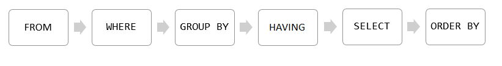

## SQL Server Basis part-1

In this class we'll cover following topics
- Querying Data
- Sorting Data
- Limiting Data
- Filtering Data
- Joining Data
- Filtering Data

### Section1: Querying Data

This section helps you learn how to query data from the SQL Server database. We will start with a simple query that allows you to retrieve data from a single table.

`SELECT` – show you how to query data against a single table.

```sql
-- syntax
SELECT
select_list
FROM
schema_name.table_name;
```
Examples:

```sql
-- examples
SELECT first_name FROM sales.customers; -- FROM >> SELECT
SELECT first_name, last_name FROM sales.customers;
SELECT * FROM sales.customers;
SELECT * FROM sales.customers WHERE state = 'CA'; -- FROM >> WHERE >> SELECT
SELECT * FROM sales.customers WHERE state = 'CA' ORDER BY first_name; -- FROM >> WHERE >> SELECT >> ORDER BY
SELECT * FROM sales.customers WHERE state = 'CA' GROUP BY city ORDER BY city; -- FROM >> WHERE >> GROUP BY >> SELECT >> ORDER BY
SELECT city, count(*) FROM sales.customers WHERE state = 'CA' GROUP BY city HAVING count(*) > 10 ORDER BY city; 
SELECT city, count(*) AS cnt FROM sales.customers WHERE state = 'CA' GROUP BY city HAVING cnt > 10 ORDER BY city;
```

In last example, SQL Server processes the clauses in the following sequence: `FROM`, `WHERE`, `GROUP BY`, `HAVING`, `SELECT`, and `ORDER BY`.



### Section1: Sorting Data

This section helps you learn how to sort the queried data from the SQL Server database.

`ORDER BY` – sort the result set based on values in a specified list of columns

```sql
-- syntax
SELECT
    select_list
FROM
    table_name
ORDER BY 
    column_name | expression [ASC | DESC ];
```
Examples:

```sql
-- examples
SELECT first_name, last_name FROM sales.customers ORDER BY first_name; -- ASC by defualt
SELECT first_name, last_name FROM sales.customers ORDER BY first_name DESC;
SELECT city, first_name, last_name FROM sales.customers ORDER BY city, first_name; -- ASC by defualt
SELECT city, first_name, last_name FROM sales.customers ORDER BY city DESC, first_name ASC;
SELECT city, first_name, last_name FROM sales.customers ORDER BY state; -- possible to order by column that is not in select
SELECT first_name, last_name FROM sales.customers ORDER BY LEN(first_name) DESC; -- Sort a result set by an expression i:e., LEN()
SELECT first_name, last_name FROM sales.customers ORDER BY 1, 2;
-- 1 means the first_name column, and 2 means the last_name column.
```

_NOTE:_
Using the ordinal positions of columns in the ORDER BY clause is considered a bad programming practice for a couple of reasons.
- First, the columns in a table don’t have ordinal positions and need to be referenced by name.
- Second, when you modify the select list, you may forget to make the corresponding changes in the ORDER BY clause.
Therefore, it is a good practice to always specify the column names explicitly in the ORDER BY clause.